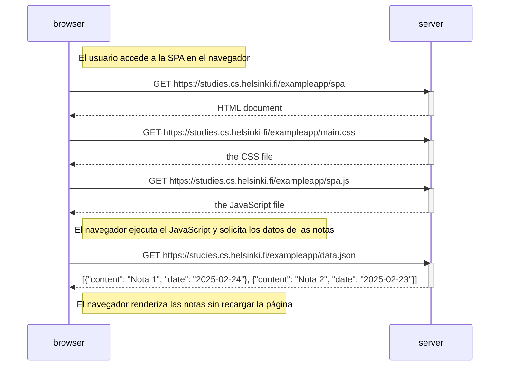

```mermaid
sequenceDiagram
participant browser
participant server

    Note right of browser: El usuario accede a la SPA en el navegador

    browser->>server: GET https://studies.cs.helsinki.fi/exampleapp/spa
    activate server
    server-->>browser: HTML document
    deactivate server

    browser->>server: GET https://studies.cs.helsinki.fi/exampleapp/main.css
    activate server
    server-->>browser: the CSS file
    deactivate server

    browser->>server: GET https://studies.cs.helsinki.fi/exampleapp/spa.js
    activate server
    server-->>browser: the JavaScript file
    deactivate server

    Note right of browser: El navegador ejecuta el JavaScript y solicita los datos de las notas

    browser->>server: GET https://studies.cs.helsinki.fi/exampleapp/data.json
    activate server
    server-->>browser: [{"content": "Nota 1", "date": "2025-02-24"}, {"content": "Nota 2", "date": "2025-02-23"}]
    deactivate server

    Note right of browser: El navegador renderiza las notas sin recargar la página
```
