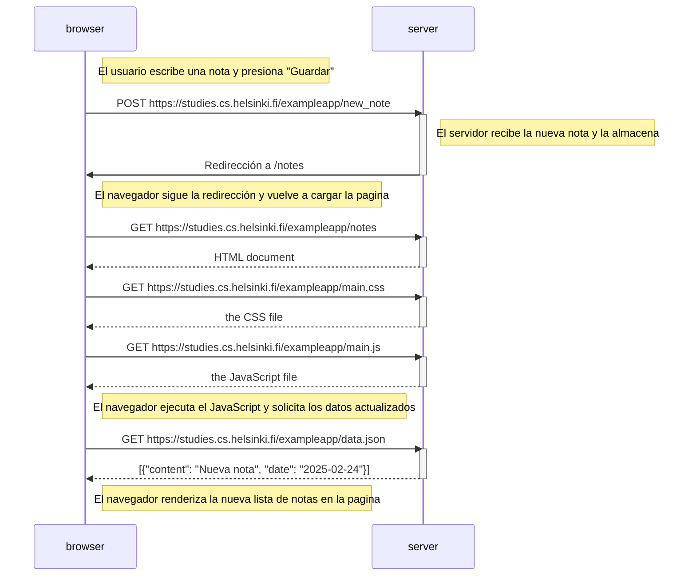

```mermaid
sequenceDiagram
    participant browser
    participant server

    Note right of browser: El usuario escribe una nota y presiona "Guardar"

    browser->>server: POST https://studies.cs.helsinki.fi/exampleapp/new_note
    activate server
    Note right of server: El servidor recibe la nueva nota y la almacena
    server->>browser: Redirección a /notes
    deactivate server

    Note right of browser: El navegador sigue la redirección y vuelve a cargar la pagina

    browser->>server: GET https://studies.cs.helsinki.fi/exampleapp/notes
    activate server
    server-->>browser: HTML document
    deactivate server

    browser->>server: GET https://studies.cs.helsinki.fi/exampleapp/main.css
    activate server
    server-->>browser: the CSS file
    deactivate server

    browser->>server: GET https://studies.cs.helsinki.fi/exampleapp/main.js
    activate server
    server-->>browser: the JavaScript file
    deactivate server

    Note right of browser: El navegador ejecuta el JavaScript y solicita los datos actualizados

    browser->>server: GET https://studies.cs.helsinki.fi/exampleapp/data.json
    activate server
    server-->>browser: [{"content": "Nueva nota", "date": "2025-02-24"}]
    deactivate server

    Note right of browser: El navegador renderiza la nueva lista de notas en la pagina
```
